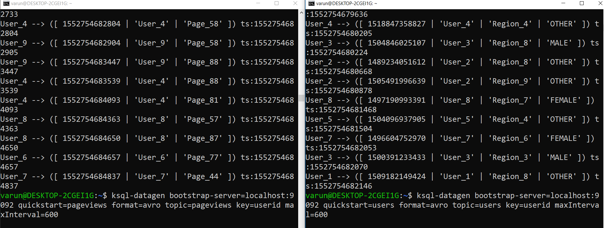
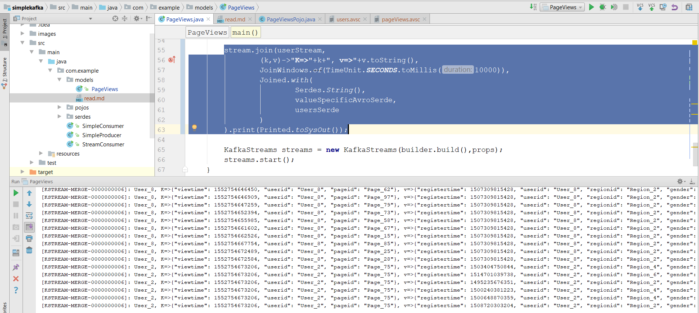

##**Stream Join example**

For this example using Ksql-datagen tool to generate sample data.

*Generate users data -*

```
ksql-datagen bootstrap-server=localhost:9092 quickstart=users format=avro topic=users key=userid maxInterval=600
```
*Generate pageviews data -*

```
ksql-datagen bootstrap-server=localhost:9092 quickstart=pageviews format=avro topic=pageviews key=userid maxInterval=600
```

*Image of sample data generation*



*Pageviews schema*
```json
{
    "type": "record",
    "name": "KsqlDataSourceSchema",
    "namespace": "io.confluent.ksql.avro_schemas",
    "fields": [{
        "name": "viewtime",
        "type": ["null", "long"],
        "default": null
    }, {
        "name": "userid",
        "type": ["null", "string"],
        "default": null
    }, {
        "name": "pageid",
        "type": ["null", "string"],
        "default": null
    }]
}
```

*users schema*
```json
{
	"type": "record",
	"name": "KsqlDataSourceSchema",
	"namespace": "io.confluent.ksql.avro_schemas",
	"fields": [{
		"name": "registertime",
		"type": ["null", "long"],
		"default": null
	}, {
		"name": "userid",
		"type": ["null", "string"],
		"default": null
	}, {
		"name": "regionid",
		"type": ["null", "string"],
		"default": null
	}, {
		"name": "gender",
		"type": ["null", "string"],
		"default": null
	}]
}
```

*Stream join*

